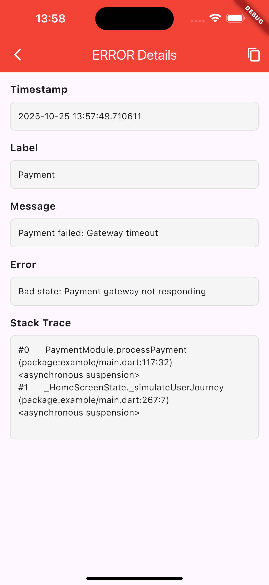
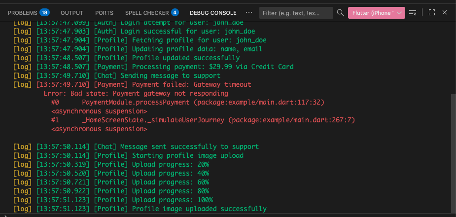

## From the Idea to code

Developers can build and view logs, but testers normally can't.

Whenever a tester reports a bug, they can also view the in-app logs, making the debugging process much faster.

## Screenshots

 



## Uses

### 1. Add dependency
```yaml
dependencies:
  in_app_console: ^1.0.0
```

### 2. Import the package
Add the following import to your Dart files where you want to use the in-app console:

```dart
import 'package:in_app_console/in_app_console.dart';
```

### 3. Create logger and add to console
```dart
final logger = InAppLogger();
logger.setLabel('MyApp'); // Optional: set a label
InAppConsole.instance.addLogger(logger);
```

### 4. Log messages
```dart
// Info logs
logger.logInfo('User logged in successfully');

// Warning logs
logger.warning(message: 'Low storage space');

// Error logs
logger.logError(
  message: 'Failed to load data',
  error: error,
  stackTrace: stackTrace,
);
```

### 5. Show console screen
```dart
// Using InAppConsole helper method
InAppConsole.instance.openConsole(context);
```
