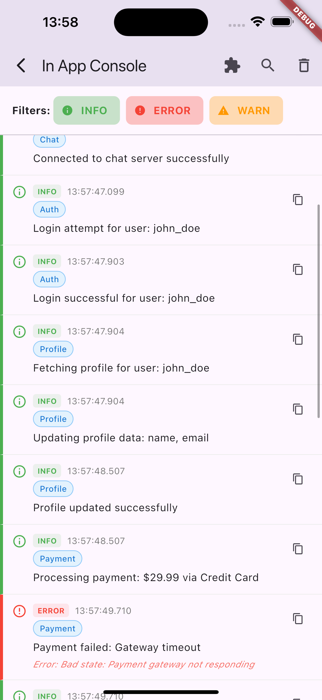

## From the Idea to code

Developers can build and view logs, but testers normally can't.

Whenever a tester reports a bug, they can also view the in-app logs, making the debugging process much faster.

## Designed for Micro-frontend architecture
```
┌─────────────────────────────────────────────────────────────────────────────┐
│            Flutter App with Micro-frontend architecture                     │
├─────────────────────────────────────────────────────────────────────────────┤
│  [Auth Module]   [Payment Module]   [Profile Module]   [Chat Module]        │
│      Logger          Logger           Logger           Logger               │
│        │               │                │               │                   │
│        └───────────────┼────────────────┼───────────────┘                   │
│                        │                │                                   │
│                        ▼                ▼                                   │
├─────────────────────────────────────────────────────────────────────────────┤
│                 [Platform Application]                                      │
│                  InAppConsole (Central)                                     │
│                                                                             │
│  Registered Loggers: [Auth, Payment, Profile, Chat]                         │
│                                                                             │
│  Unified History:                                                           │
│  • [Auth] User login                                                        │
│  • [Pay]  Payment failed                                                    │
│  • [Prof] Profile updated                                                   │
│  • [Chat] Message sent                                                      │
│                        │                                                    │
│                        ▼                                                    │
├─────────────────────────────────────────────────────────────────────────────┤
│                   Console UI Screen                                         │
│                                                                             │      │                                                                             │
│  Log Display:                                                               │
│  14:23 [Auth] User login successful                                         │
│  14:24 [Pay]  Payment gateway timeout                                       │
│  14:25 [Prof] Profile image uploaded                                        │
│  14:26 [Chat] Message sent                                                  │
└─────────────────────────────────────────────────────────────────────────────┘
```

## Screenshots

 


## Uses

### 1. Add dependency
```yaml
dependencies:
  in_app_console: ^1.0.0
```

### 2. Import the package
Add the following import to your Dart files where you want to use the in-app console:

```dart
import 'package:in_app_console/in_app_console.dart';
```

### 3. Create logger and add to console
```dart
final logger = InAppLogger();
logger.setLabel('MyApp'); // Optional: set a label
InAppConsole.instance.addLogger(logger);
```

### 4. Log messages
```dart
// Info logs
logger.logInfo('User logged in successfully');

// Warning logs
logger.warning(message: 'Low storage space');

// Error logs
logger.logError(
  message: 'Failed to load data',
  error: error,
  stackTrace: stackTrace,
);
```

### 5. Show console screen
```dart
// Using InAppConsole helper method
InAppConsole.instance.openConsole(context);
```
